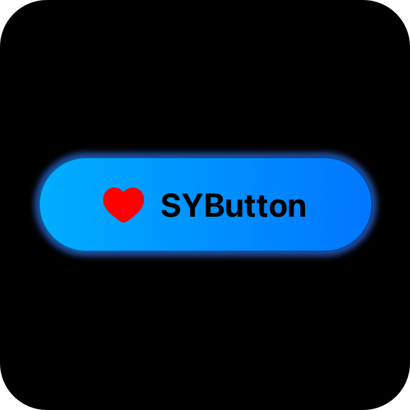
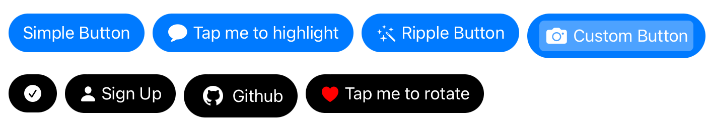
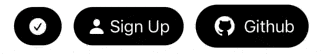
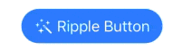
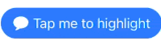
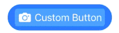
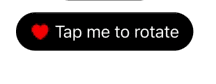

<div>


# SYButton
</div>


SYButton is a yet another simple but customizable and button. With support for dynamic styling, highlighters, and loading states.
<div>
<br>
<div align="center">

</div>

## Usage
#### Basic Usage

To create and display a basic SYButton:

```swift
import SYButton

let button = SYButton(title: "Tap Me", subtitle: "Button Subtitle")
button.handler = { sender in
    print("Button tapped!")
}
view.addSubview(button)
```

##### Customizing the Button
You can customize the appearance and behavior of the button:
```swift
button.icon = IconSource(image: UIImage(systemName: "heart.fill"), tintColor: .red)
button.cornerRadius = .radius(8)
button.imagePlacement = .leading
button.contentInsets = UIEdgeInsets(top: 8, left: 16, bottom: 8, right: 16)
```

##### Loading State

<div>
  
</div>

The `SYButton` offers a way to indicate a loading state, which is particularly useful for scenarios such as network requests or other asynchronous tasks. When the button enters the loading state, it can display a loading indicator in place of the icon, and the title can be updated to reflect the ongoing process.
```swift
button.setLoading(true, with: "Loading...")
// or simply
button.isLoading = true
```
`SYButton` comes with several built-in loading indicators that you can use to customize the loading state:
- `SYLoadingSpinner`: A simple and clean spinner that is the default loading indicator for `SYButton`.
- `SYBallPulseIndicator`: A loading indicator that displays three pulsing balls.
- `UIActivityIndicatorView`: The standard loading indicator provided by UIKit.

You can set any of these indicators by assigning them to the activityIndicator property of the button:
```swift
button.activityIndicator = SYBallPulseIndicator()
// or
button.activityIndicator = UIActivityIndicatorView()
```

###### SYLoadingIndicator Protocol
The SYLoadingIndicator protocol defines the requirements for a custom loading indicator that can be used with `SYButton. The protocol includes properties and methods for controlling the animation and appearance of the indicator.
To create your own custom loading indicator, simply conform to the SYLoadingIndicator protocol:
```swift
public protocol SYLoadingIndicator: UIView {
    var isAnimating: Bool { get }
    var indicatorColor: UIColor { get set }
    
    func startAnimating()
    func stopAnimating()
}

// Custom Indicator
class CustomLoadingIndicator: UIView, SYLoadingIndicator {
    var isAnimating: Bool = false
    var indicatorColor: UIColor = .gray

    func startAnimating() {
        // Start custom animation
        isAnimating = true
    }

    func stopAnimating() {
        // Stop custom animation
        isAnimating = false
    }
}

...
button.activityIndicator = CustomLoadingIndicator()
```

##### Highlighter
<div>
  
  
  
</div>

The `SYButton` supports a variety of highlight effects that can be applied when the button is pressed. 
These highlight effects provide visual feedback to users, enhancing the interaction experience. 
The highlight effect is controlled by assigning a highlighter to the `SYButton using the highlighter property.

###### Usage
To apply a highlighter to the button, set the highlighter property to an instance of a class that conforms to the SYButtonHighlighter protocol.
```swift
button.highlighter = SYScaleAlphaHighlighter()
```

###### Available Highlighters
`SYButton` comes with several built-in highlighters that you can use to customize the button's highlight effect:

- `SYScaleAlphaHighlighter`: Scales the button down and adjusts the alpha when highlighted.
- `SYRippleHighlighter`: Creates a ripple effect originating from the touch point when the button is highlighted.

###### SYButtonHighlighter Protocol
The `SYButtonHighlighter` protocol defines the requirements for a custom highlighter that can be used with `SYButton`.
The protocol includes methods for starting, stopping, and tracking the highlight effect.
```swift
public protocol SYButtonHighlighter {
    func highlight(_ button: SYButton, at location: CGPoint)
    func stopHighlight(_ button: SYButton)
    func locationMoved(_ button: SYButton, to location: CGPoint)
}
```

To create your own custom highlighter, simply conform to the SYButtonHighlighter protocol:
```swift
class CustomHighlighter: SYButtonHighlighter {
    func highlight(_ button: SYButton, at location: CGPoint) {
        // Custom highlight effect
    }

    func stopHighlight(_ button: SYButton) {
        // Stop custom highlight effect
    }

    func locationMoved(_ button: SYButton, to location: CGPoint) {
        // Optional: Track touch movement
    }
}

...
// use the highlighter
button.highlighter = CustomHighlighter()
```
##### Image Placement
<div>
  
</div>

`SYButton` allows you to customize the placement of the image relative to the text within the button.
This can be easily configured using the imagePlacement property. The available options are:

.leading - The image appears to the left of the text. This is the default option.
.trailing - The image appears to the right of the text.
.top - The image appears above the text.
.bottom - The image appears below the text.

###### Usage
```swift
let button = SYButton(title: "Example Button")
button.icon = IconSource(image: UIImage(named: "example"))
button.imagePlacement = .top
```
## Options

| Option              | Description                                                                                                   |
|---------------------|---------------------------------------------------------------------------------------------------------------|
| `titleLabel`               | Publicly accessible title label for customization. (`UILabel`, default: system label)                         |
| `subtitleLabel`            | Publicly accessible subtitle label for customization. (`UILabel`, default: system label)                      |
| `title`             | The text displayed as the main title on the button. (`String?`, default: `nil`)                                |
| `subtitle`          | The text displayed as the subtitle on the button. (`String?`, default: `nil`)                                  |
| `icon`              | The `IconSource` for the button, including image and tint color. (`IconSource`, default: `IconSource()`)       |
| `isLoading`         | Flag indicating whether the button is in the loading state. (`Bool`, default: `false`)                        |
| `highlighter`       | The highlighter effect applied when the button is pressed. (`SYButtonHighlighter?`, default: `nil`)           |
| `handler`           | Closure that will be executed when the button is pressed. (`((SYButton) -> Void)?`, default: `nil`)           |
| `feedback`          | Optional haptic feedback configuration that will be triggered on button press. (`Feedback?`, default: `nil`)   |
| `cornerRadius`      | The corner radius setting for the button. (`CornerRadius`, default: `.radius(0)`)                              |
| `imagePlacement`    | The placement of the icon relative to the title. (`ImagePlacement`, default: `.leading`)                      |
| `activityIndicator` | The loading indicator used when `isLoading` is set to true. (`SYLoadingIndicator`, default: `SYLoadingSpinner()`) |
| `contentInsets`     | Insets for the button's content. (`UIEdgeInsets`, default: `UIEdgeInsets(top: 7, left: 12, bottom: 7, right: 12)`) |
| `backgroundColor`   | The background color of the button. (`UIColor?`, default: `nil`)                                              |
| `alignment`         | Alignment of content within the button. (`UIStackView.Alignment`, default: `.fill`)                           |
| `imagePadding`      | Spacing between the image and title. (`CGFloat`, default: `4`)                                                |
| `updateHandler`     | Handler that allows external configuration updates when the button's state changes. (`((SYButton) -> Void)?`, default: `nil`) |
| `activityIndicator`        | The loading indicator used when `isLoading` is set to true. (`SYLoadingIndicator`, default: `SYLoadingSpinner()`) |
| `feedback`                 | Optional haptic feedback configuration that will be triggered on button press. (`Feedback?`, default: `nil`)   |
| `highlighter`              | The highlighter effect applied when the button is pressed. (`SYButtonHighlighter?`, default: `nil`)           |
| `backgroundView`           | The background view of the button, allowing for custom background configurations like gradients. (`SYButtonBackgroundView`, default: `SYButtonBackgroundView()`) |
| `contentBackgroundView`    | The view that contains the content of the button, allowing for custom configurations like margins and padding. (`UIView`, default: `UIView()`) |


## Requirements

- iOS 12.0+
- Xcode 12+
- Swift 5.0+

## Installation

### Swift Package Manager

To integrate `SYButton` into your project using Swift Package Manager, add the following to your `Package.swift` file:

```swift
dependencies: [
    .package(url: "https://github.com/emrearmagan/SYButton.git", from: "0.0.1")
]
```

### Installing manually
1. Download SYButton.zip from the last release and extract its content in your project's folder.
2. From the Xcode project, choose Add Files to ... from the File menu and add the extracted files.

### Contributing
Contributions are welcome! If you’d like to contribute, please open a pull request or issue on GitHub.

### License
`SYButton` is available under the MIT license. See the LICENSE file for more information.